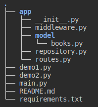

# Basic REST operations with Flask

Σε  αυτό το εργαστήριο
- Θα συζητούμε της βασικές αρχές για REST services.
- Στη συνέχεια θα δούμε πως λειτουργεί το flask. Το flask είναι ένα python microframework για υλοποίηση APIs.
- Θα κάνουμε κάποιες ασκήσεις εξοικείωσης με το flask ([demo1.py](./demo1.py), [demo2.py](./demo2.py))
- Θα συζητήσουμε καλές πρακτικές υλοποίησης για API resources.
- Θα υλοποιήσουμε μια εφαρμογή βιβλιοθήκης με βασικές CRUD (Create Read Update Delete) λειτουργίες όπου κάποιος χρήστης θα μπορεί:
  1. Να δει την λίστα με τα διαθέσιμα βιβλία
  2. Να ψάξει και να βρει ένα βιβλίο
  3. Να ενημερώσει στοιχεία ενός βιβλίου
  4. Να διαγράψει ένα βιβλίο

- Θα υλοποιήσουμε μηχανισμούς ελέγχου εξουσιοδότησης ώστε να υπάρχει έλεγχος πρόσβασης στις λειτουργίες πάνω στα resourses.

> Για να μπορούμε να κάνουμε requests στα resources χωρίς authorization πρέπει να σχολιάσουμε το `@token_required` σε όποιες συναρτήσεις βρίσκεται μέσα στο αρχεία `routes.py`

Για να δοκιμάσουμε το authorization πρέπει να κάνουμε τα εξής βήματα
1. Το `@token_required` πρέπει να μην είναι σχολιασμένο στις συναρτήσεις στο αρχείο `routes.py`.
2. Κάνουμε ένα POST request στο ‘http://locallhost:5000/token’ για να πάρουμε token. Στο body του request πρέπει να υπάρχουν τα “username” = “admin” και “password” = “admin”.
3. Κάνουμε request σε endpoint που χρειάζεται authorization και βάζουμε στα headers του request το token που πήραμε.

## Project structure

The structure of the project is the following  

## Προαπαιτούμενα

1. Δημιουργούμε virtual environment
2. Ενεργοποιούμε το virtual environment
3. Εγκαθιστούμε (στο virutal environment) τα πακέτα που αναγράφονται στο αρχείο requirements.txt
4. Τρέχουμε την εφαρμογή με `python main.py`
